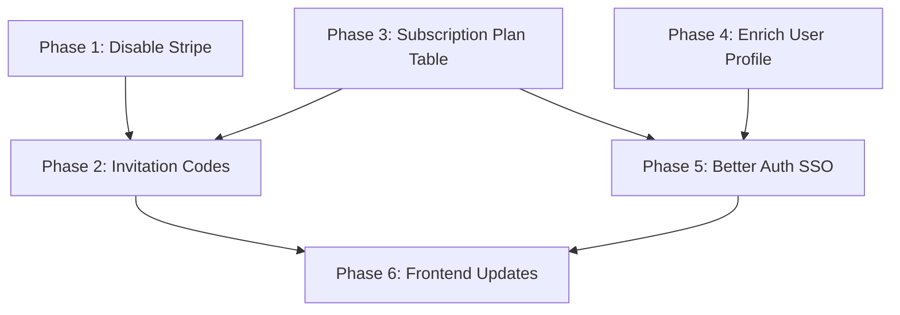

# Migration Strategy: Auth, Subscription & Payment Overhaul

## Overview

This document outlines the migration plan for three major changes:

1. **Disable Stripe** — Comment out / feature-flag Stripe integration (keep code for future re-enablement)
2. **Invitation Code System** — Replace payment-based top-up/subscription with redeemable invitation codes
3. **Better Auth + SSO** — Replace custom JWT auth with [Better Auth](https://www.better-auth.com/) supporting Google & GitHub SSO
4. **Proper Subscription Plan Table** — Normalize subscription plans into a dedicated table with clean user relationship
5. **Enrich User Profile** — Add missing user fields (name, avatar, phone, etc.)

---

## Phase 1: Disable Stripe (Non-breaking)

### What to do

- Remove `STRIPE_SECRET_KEY` and `STRIPE_WEBHOOK_SECRET` from `.env` (keep in `.env.example` with comment `# Disabled - will re-enable later`)
- Add a feature flag in `AppConfig` or a simple env var `STRIPE_ENABLED=false`
- Guard the billing controller endpoints:
  ```ts
  // billing.controller.ts
  if (!process.env.STRIPE_ENABLED || process.env.STRIPE_ENABLED === 'false') {
    throw new ServiceUnavailableException('Payment via Stripe is temporarily disabled');
  }
  ```
- Keep all Stripe code intact (no deletion) — just unreachable behind the flag
- Keep the `Transaction` model — it will be reused for invitation code redemptions

### Files affected

| File | Change |
|------|--------|
| `.env.example` | Add `STRIPE_ENABLED=false`, comment Stripe keys |
| `apps/api/src/app/billing/billing.controller.ts` | Guard with feature flag |
| `apps/api/src/app/webhooks/webhook.controller.ts` | Guard with feature flag |

---

## Phase 2: Invitation Code System

### Concept

Instead of paying with Stripe, users enter **invitation codes** to:
- Top up their credit balance
- Activate/upgrade their subscription plan

Codes are generated by admins and carry a specific reward (credits and/or plan activation).

### New Schema: `InvitationCode`

```prisma
model InvitationCode {
  id              String    @id @default(uuid())
  code            String    @unique // e.g. "PERF-XXXX-XXXX"
  type            String    // "topup" | "subscription" | "both"
  
  // Top-up reward
  creditAmount    Decimal?  @db.Decimal(12, 6) @map("credit_amount")
  
  // Subscription reward
  planId          String?   @map("plan_id")
  plan            SubscriptionPlan? @relation(fields: [planId], references: [id])
  durationDays    Int?      @map("duration_days") // How many days the plan is granted
  
  // Usage limits
  maxRedemptions  Int       @default(1) @map("max_redemptions")
  timesRedeemed   Int       @default(0) @map("times_redeemed")
  
  // Validity (defaults to 2 months from creation)
  expiresAt       DateTime  @default(dbgenerated("NOW() + INTERVAL '2 months'")) @map("expires_at") @db.Timestamptz()
  isActive        Boolean   @default(true) @map("is_active")
  
  // Tracking
  createdById     String?   @map("created_by_id")
  redemptions     CodeRedemption[]
  createdAt       DateTime  @default(now()) @db.Timestamptz()
  updatedAt       DateTime  @updatedAt @db.Timestamptz()

  @@index([code])
  @@index([isActive, expiresAt])
  @@map("invitation_codes")
}

model CodeRedemption {
  id              String         @id @default(uuid())
  codeId          String         @map("code_id")
  code            InvitationCode @relation(fields: [codeId], references: [id])
  userId          String         @map("user_id")
  user            User           @relation(fields: [userId], references: [id])
  
  // What was granted
  creditsGranted  Decimal?       @db.Decimal(12, 6) @map("credits_granted")
  planGranted     String?        @map("plan_granted") // plan slug snapshot
  daysGranted     Int?           @map("days_granted")
  
  redeemedAt      DateTime       @default(now()) @map("redeemed_at") @db.Timestamptz()

  @@unique([codeId, userId]) // Each user can redeem a code only once
  @@index([userId])
  @@map("code_redemptions")
}
```

### API Endpoints

| Method | Path | Description |
|--------|------|-------------|
| `POST` | `/codes/redeem` | User submits a code → validates → grants credits/plan |
| `GET`  | `/codes/history` | User sees their redemption history |
| `POST` | `/admin/codes` | Admin creates invitation codes |
| `GET`  | `/admin/codes` | Admin lists all codes with usage stats |
| `PATCH`| `/admin/codes/:id` | Admin deactivates/modifies a code |

### Redemption Flow

```
1. User enters code in UI (Settings page or Subscription page)
2. POST /codes/redeem { code: "PERF-XXXX-XXXX" }
3. Server validates:
   - Code exists and is active
   - Not expired
   - maxRedemptions not reached
   - User hasn't already redeemed this code
4. In a transaction:
   a. If type includes "topup": user.balance += creditAmount, create Transaction record
   b. If type includes "subscription": create/extend UserSubscription with plan
   c. Increment timesRedeemed
   d. Create CodeRedemption record
5. Return { success: true, creditsGranted, planGranted }
```

### Frontend Changes

- **Settings Page**: Add "Redeem Code" input field with a submit button
- **Subscription Page**: Add "Activate with Code" option alongside plan cards

---

## Phase 3: Subscription Plan Table (Normalization)

### Problem

Currently `AgentSubscription.tier` is a raw string (`"starter"`, `"pro"`, `"enterprise"`) with limits hard-coded in the service layer. This is inflexible.

### New Schema

```prisma
model SubscriptionPlan {
  id                String   @id @default(uuid())
  slug              String   @unique // "starter" | "pro" | "enterprise" | custom
  name              String   // "Starter Plan"
  description       String?
  
  // Limits
  maxAgents         Int      @map("max_agents")
  maxIntegrations   Int      @map("max_integrations")
  maxWorkspaceUsers Int      @map("max_workspace_users")
  maxTokensPerMonth BigInt   @map("max_tokens_per_month")
  allowedChannels   String[] @map("allowed_channels") // ["web", "api", "whatsapp"]
  
  // Pricing (for display, not billing — billing is via invitation codes)
  priceMonthly      Decimal? @db.Decimal(10, 2) @map("price_monthly")
  priceCurrency     String   @default("USD") @map("price_currency")
  
  // Status
  isActive          Boolean  @default(true) @map("is_active")
  displayOrder      Int      @default(0) @map("display_order")
  
  // Relations
  invitationCodes   InvitationCode[]
  userSubscriptions UserSubscription[]
  
  createdAt         DateTime @default(now()) @db.Timestamptz()
  updatedAt         DateTime @updatedAt @db.Timestamptz()

  @@map("subscription_plans")
}

// Replaces AgentSubscription — now references a plan row
model UserSubscription {
  id                 String           @id @default(uuid())
  userId             String           @map("user_id")
  user               User             @relation(fields: [userId], references: [id])
  planId             String           @map("plan_id")
  plan               SubscriptionPlan @relation(fields: [planId], references: [id])
  
  status             String           @default("active") // "active" | "canceled" | "expired"
  currentPeriodStart DateTime         @map("current_period_start") @db.Timestamptz()
  currentPeriodEnd   DateTime         @map("current_period_end") @db.Timestamptz()
  
  // Usage tracking
  messagesUsed       Int              @default(0) @map("messages_used")
  tokensUsed         BigInt           @default(0) @map("tokens_used")
  
  cancelAtPeriodEnd  Boolean          @default(false) @map("cancel_at_period_end")
  createdAt          DateTime         @default(now()) @db.Timestamptz()
  updatedAt          DateTime         @updatedAt @db.Timestamptz()

  @@index([userId, status])
  @@index([planId])
  @@map("user_subscriptions")
}
```

### Migration from `AgentSubscription`

1. Create `subscription_plans` table with seed data for starter/pro/enterprise
2. Create `user_subscriptions` table
3. Migrate existing `agent_subscriptions` rows:
   ```sql
   INSERT INTO user_subscriptions (id, user_id, plan_id, status, current_period_start, current_period_end, messages_used, tokens_used, cancel_at_period_end, created_at, updated_at)
   SELECT as2.id, as2.user_id, sp.id, as2.status, as2.current_period_start, as2.current_period_end, as2.messages_used, as2.tokens_used, as2.cancel_at_period_end, as2.created_at, as2.updated_at
   FROM agent_subscriptions as2
   JOIN subscription_plans sp ON sp.slug = as2.tier;
   ```
4. Update service layer to read limits from `SubscriptionPlan` row instead of hard-coded switch/case
5. Drop `agent_subscriptions` table after verification

### Seed Data

```ts
const plans = [
  { slug: 'starter', name: 'Starter', maxAgents: 3, maxIntegrations: 1, maxWorkspaceUsers: 3, maxTokensPerMonth: 1_000_000n, allowedChannels: ['web'], priceMonthly: 19 },
  { slug: 'pro', name: 'Pro', maxAgents: 10, maxIntegrations: 3, maxWorkspaceUsers: 10, maxTokensPerMonth: 10_000_000n, allowedChannels: ['web', 'api'], priceMonthly: 49 },
  { slug: 'enterprise', name: 'Enterprise', maxAgents: 999, maxIntegrations: 999, maxWorkspaceUsers: 100, maxTokensPerMonth: 100_000_000n, allowedChannels: ['web', 'api', 'whatsapp'], priceMonthly: 149 },
];
```

---

## Phase 4: Enrich User Profile

### Current User fields

```
id, email, password, balance, apiKey, createdAt
```

### Proposed additions

```prisma
model User {
  id            String         @id @default(uuid())
  email         String         @unique
  emailVerified Boolean        @default(false) @map("email_verified")
  password      String?        // Nullable — SSO users won't have a password
  
  // Profile fields
  name          String?
  firstName     String?        @map("first_name")
  lastName      String?        @map("last_name")
  avatar        String?        // URL to profile picture
  phone         String?
  company       String?
  jobTitle      String?        @map("job_title")
  timezone      String?        @default("UTC")
  locale        String?        @default("en")
  
  // Auth
  apiKey        String         @unique @default(uuid())
  lastLoginAt   DateTime?      @map("last_login_at") @db.Timestamptz()
  lastLoginIp   String?        @map("last_login_ip")
  
  // Status
  status        String         @default("active") // "active" | "suspended" | "deleted"
  
  // Billing
  balance       Decimal        @default(0) @db.Decimal(12, 6)
  
  // SSO accounts (managed by Better Auth)
  accounts      Account[]
  sessions      Session[]
  
  // Existing relations (unchanged)
  subscription      UserSubscription?  // Changed from agentSubscription
  codeRedemptions   CodeRedemption[]
  // ... rest of existing relations
  
  createdAt     DateTime       @default(now()) @db.Timestamptz()
  updatedAt     DateTime       @updatedAt @db.Timestamptz()

  @@map("users")
}
```

---

## Phase 5: Better Auth + SSO (Google & GitHub)

### Why Better Auth?

- Drop-in auth library for TypeScript/Node.js
- Built-in OAuth providers (Google, GitHub, etc.)
- Session management with database adapter
- Works alongside existing NestJS — no full rewrite needed
- Supports email/password + social login simultaneously

### Integration Plan

#### 5.1 Install Better Auth

```bash
bun add better-auth
```

#### 5.2 Better Auth Schema Additions

Better Auth requires specific tables. Using Prisma adapter:

```prisma
// Better Auth required tables
model Account {
  id                String   @id @default(uuid())
  userId            String   @map("user_id")
  user              User     @relation(fields: [userId], references: [id], onDelete: Cascade)
  accountId         String   @map("account_id")      // Provider's user ID
  providerId        String   @map("provider_id")     // "google" | "github" | "credential"
  accessToken       String?  @map("access_token")
  refreshToken      String?  @map("refresh_token")
  accessTokenExpiresAt DateTime? @map("access_token_expires_at") @db.Timestamptz()
  scope             String?
  idToken           String?  @map("id_token")
  password          String?  // For credential provider
  createdAt         DateTime @default(now()) @db.Timestamptz()
  updatedAt         DateTime @updatedAt @db.Timestamptz()

  @@unique([providerId, accountId])
  @@index([userId])
  @@map("accounts")
}

model Session {
  id        String   @id @default(uuid())
  userId    String   @map("user_id")
  user      User     @relation(fields: [userId], references: [id], onDelete: Cascade)
  token     String   @unique
  ipAddress String?  @map("ip_address")
  userAgent String?  @map("user_agent")
  expiresAt DateTime @map("expires_at") @db.Timestamptz()
  createdAt DateTime @default(now()) @db.Timestamptz()
  updatedAt DateTime @updatedAt @db.Timestamptz()

  @@index([userId])
  @@index([token])
  @@map("sessions")
}

model Verification {
  id         String   @id @default(uuid())
  identifier String   // email or phone
  value      String   // token/code
  expiresAt  DateTime @map("expires_at") @db.Timestamptz()
  createdAt  DateTime @default(now()) @db.Timestamptz()
  updatedAt  DateTime @updatedAt @db.Timestamptz()

  @@map("verifications")
}
```

#### 5.3 Better Auth Configuration

```ts
// apps/api/src/lib/auth.ts
import { betterAuth } from "better-auth";
import { prismaAdapter } from "better-auth/adapters/prisma";
import { PrismaClient } from "../generated/prisma";

const prisma = new PrismaClient();

export const auth = betterAuth({
  database: prismaAdapter(prisma, { provider: "postgresql" }),
  emailAndPassword: { enabled: true },
  socialProviders: {
    google: {
      clientId: process.env.GOOGLE_CLIENT_ID!,
      clientSecret: process.env.GOOGLE_CLIENT_SECRET!,
    },
    github: {
      clientId: process.env.GITHUB_CLIENT_ID!,
      clientSecret: process.env.GITHUB_CLIENT_SECRET!,
    },
  },
  session: {
    expiresIn: 7 * 24 * 60 * 60, // 7 days
    updateAge: 24 * 60 * 60, // 1 day
  },
  user: {
    additionalFields: {
      apiKey: { type: "string", required: false },
      balance: { type: "number", required: false, defaultValue: 0 },
      phone: { type: "string", required: false },
      company: { type: "string", required: false },
      jobTitle: { type: "string", required: false },
      timezone: { type: "string", required: false, defaultValue: "UTC" },
      status: { type: "string", required: false, defaultValue: "active" },
    },
  },
});
```

#### 5.4 NestJS Integration Strategy

Since Better Auth is framework-agnostic and exposes a handler, integrate it in NestJS:

```ts
// apps/api/src/app/auth/better-auth.controller.ts
@Controller("auth")
export class BetterAuthController {
  @All("*")
  async handleAuth(@Req() req: Request, @Res() res: Response) {
    return auth.handler(req, res);
  }
}
```

For guards, replace the current JWT strategy with a session-based guard:

```ts
// apps/api/src/app/guards/session.guard.ts
@Injectable()
export class SessionGuard implements CanActivate {
  async canActivate(context: ExecutionContext): Promise<boolean> {
    const request = context.switchToHttp().getRequest();
    const session = await auth.api.getSession({ headers: request.headers });
    if (!session) return false;
    request.user = session.user;
    return true;
  }
}
```

#### 5.5 Migration Path for Existing Users

- Existing users already have email+password → Create an `Account` row with `providerId: "credential"` for each
- When user links Google/GitHub later → Additional `Account` row is created
- `User.password` becomes nullable (SSO users won't have one)

#### 5.6 New Environment Variables

```env
# Better Auth
BETTER_AUTH_SECRET="random-secret-for-signing"
BETTER_AUTH_URL="http://localhost:3000"

# Google OAuth
GOOGLE_CLIENT_ID=""
GOOGLE_CLIENT_SECRET=""

# GitHub OAuth
GITHUB_CLIENT_ID=""
GITHUB_CLIENT_SECRET=""
```

---

## Phase 6: Frontend Client (Better Auth)

```ts
// apps/chat/src/lib/auth-client.ts (and dashboard)
import { createAuthClient } from "better-auth/react";

export const authClient = createAuthClient({
  baseURL: process.env.NEXT_PUBLIC_API_URL,
});

export const { signIn, signUp, signOut, useSession } = authClient;
```

Usage:
```tsx
// Google sign-in
await signIn.social({ provider: "google", callbackURL: "/dashboard" });

// GitHub sign-in
await signIn.social({ provider: "github", callbackURL: "/dashboard" });

// Email/password (backward compatible)
await signIn.email({ email, password });
```

---

## Execution Order & Dependencies



### Recommended execution sequence:

| Step | Phase | Estimated Complexity | Breaking Change? |
|------|-------|---------------------|------------------|
| 1 | Phase 1: Disable Stripe | Low | No |
| 2 | Phase 4: Enrich User Profile | Low | No (additive migration) |
| 3 | Phase 3: Subscription Plan Table | Medium | Yes (service layer update) |
| 4 | Phase 2: Invitation Code System | Medium | No (new feature) |
| 5 | Phase 5: Better Auth + SSO | High | Yes (auth system swap) |
| 6 | Phase 6: Frontend Auth Client | Medium | Yes (login flow change) |

---

## Database Migration Plan

### Migration 1: Add profile fields + plan tables (non-breaking)

```sql
-- Add user profile fields
ALTER TABLE users ADD COLUMN name TEXT;
ALTER TABLE users ADD COLUMN first_name TEXT;
ALTER TABLE users ADD COLUMN last_name TEXT;
ALTER TABLE users ADD COLUMN avatar TEXT;
ALTER TABLE users ADD COLUMN phone TEXT;
ALTER TABLE users ADD COLUMN company TEXT;
ALTER TABLE users ADD COLUMN job_title TEXT;
ALTER TABLE users ADD COLUMN timezone TEXT DEFAULT 'UTC';
ALTER TABLE users ADD COLUMN locale TEXT DEFAULT 'en';
ALTER TABLE users ADD COLUMN email_verified BOOLEAN DEFAULT false;
ALTER TABLE users ADD COLUMN last_login_at TIMESTAMPTZ;
ALTER TABLE users ADD COLUMN last_login_ip TEXT;
ALTER TABLE users ADD COLUMN status TEXT DEFAULT 'active';
ALTER TABLE users ADD COLUMN updated_at TIMESTAMPTZ DEFAULT NOW();

-- Make password nullable (for future SSO users)
ALTER TABLE users ALTER COLUMN password DROP NOT NULL;

-- Create subscription_plans table
CREATE TABLE subscription_plans ( ... );

-- Create user_subscriptions table
CREATE TABLE user_subscriptions ( ... );

-- Migrate data from agent_subscriptions → user_subscriptions
INSERT INTO user_subscriptions (...) SELECT ... FROM agent_subscriptions JOIN subscription_plans ON ...;
```

### Migration 2: Invitation codes

```sql
CREATE TABLE invitation_codes ( ... );
CREATE TABLE code_redemptions ( ... );
```

### Migration 3: Better Auth tables

```sql
CREATE TABLE accounts ( ... );
CREATE TABLE sessions ( ... );
CREATE TABLE verifications ( ... );

-- Backfill accounts for existing users
INSERT INTO accounts (id, user_id, account_id, provider_id, password, created_at, updated_at)
SELECT gen_random_uuid(), id, id, 'credential', password, created_at, NOW()
FROM users WHERE password IS NOT NULL;
```

### Migration 4: Cleanup

```sql
-- Drop old table after verification
DROP TABLE agent_subscriptions;
```

---

## Risk Mitigation

| Risk | Mitigation |
|------|-----------|
| Existing users can't log in after auth swap | Keep email/password as a Better Auth provider; existing bcrypt hashes are compatible |
| Data loss during subscription migration | Run migration in transaction; keep old table until verified |
| Invitation code abuse | Rate limit redemption endpoint; unique constraint per user-code pair |
| SSO account linking conflicts | Match by verified email; prompt user to link if email matches existing account |
| API key auth breaks | Keep `ApiKeyGuard` unchanged — it's independent of session auth |

---

## Summary of New Dependencies

```json
{
  "better-auth": "^1.x",
}
```

No LemonSqueezy dependency needed — the invitation code system is self-contained.

---

## Files to Create/Modify

### New files
- `apps/api/src/lib/auth.ts` — Better Auth instance
- `apps/api/src/app/auth/better-auth.controller.ts` — Route handler
- `apps/api/src/app/guards/session.guard.ts` — New session guard
- `apps/api/src/app/codes/codes.module.ts` — Invitation code module
- `apps/api/src/app/codes/codes.service.ts` — Redemption logic
- `apps/api/src/app/codes/codes.controller.ts` — API endpoints
- `apps/api/src/app/codes/dto/redeem-code.dto.ts` — Validation DTO
- `apps/chat/src/lib/auth-client.ts` — Frontend auth client
- `apps/dashboard/src/lib/auth-client.ts` — Dashboard auth client

### Modified files
- `prisma/schema.prisma` — New tables, user fields, nullable password
- `.env.example` — New env vars (Google, GitHub, Better Auth)
- `apps/api/src/app/auth/auth.module.ts` — Register Better Auth
- `apps/api/src/app/auth/auth.service.ts` — Adapt for Better Auth
- `apps/api/src/app/agent/agent.service.ts` — Read limits from plan table
- `apps/api/src/app/billing/billing.controller.ts` — Feature flag guard
- `apps/api/src/app/webhooks/webhook.controller.ts` — Feature flag guard
- `prisma/seed.ts` — Seed subscription plans
